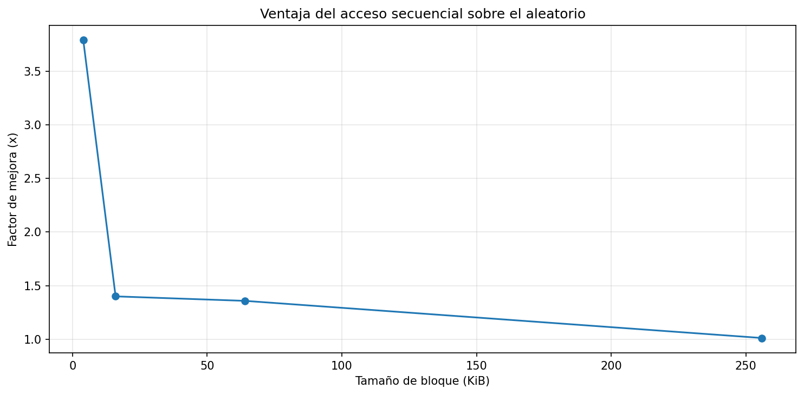
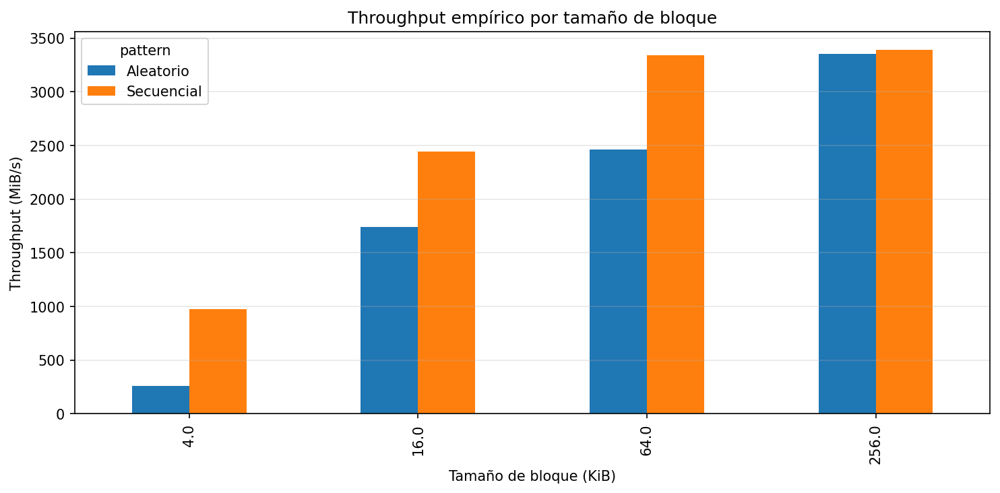
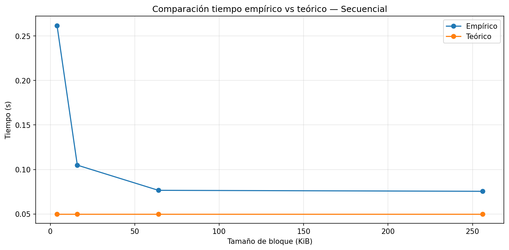
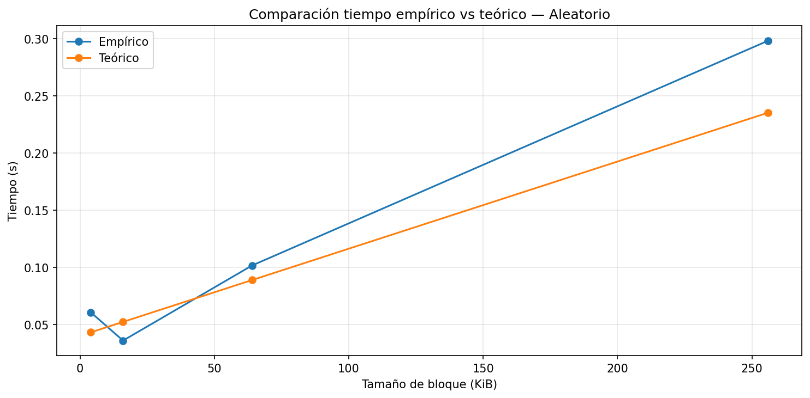
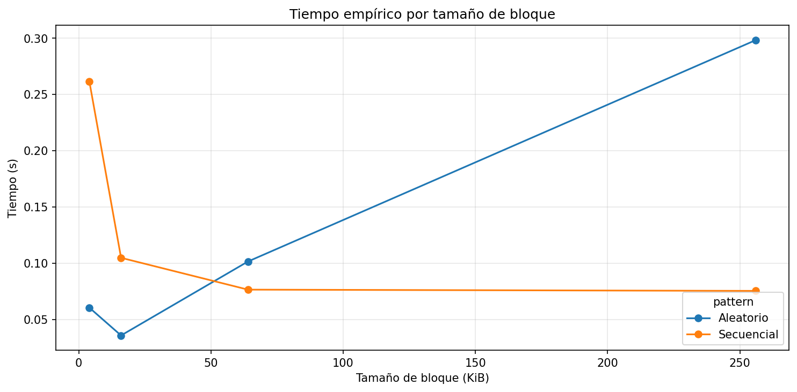

# lab3-IO_performance-CarolinaGomez

## Caracterización del Equipo

| Parámetro | Valor de Referencia |
| --- | --- |
| Sistema Operativo | Windows 11 25H2 |
| CPU (Modelo) | 11th Gen Intel Core i5-1135G7 @2.40 GHz |
| Arquitectura | x64 |
| Núcleos y Procesadores Lógicos | 4 núcleos / 8 procesadores Lógicos |
| Memoria RAM Total | 8 GB |
| Tipo de Disco | SSD NVMe WDC PC SN530 SDBPNPZ-256G-1006 |
| Carga de CPU en Reposo | ~ 2% |

## Análisis del Experimento

### 1. Comparación de Patrones
*Con base en sus mediciones, ¿cuántas veces más rápido fue el acceso secuencial respecto al aleatorio en su equipo? ¿Ese resultado era el esperado según la teoría?*

Con base en los resultados del experimento, el acceso secuencial fue más rápido que el aleatorio en todos los tamaños de bloque evaluados, aunque la magnitud de esa ventaja varió bastante. Por ejemplo, con bloques de 4 KiB el acceso secuencial fue 3.79 veces más rápido que el aleatorio (978.10 MiB/s vs 258.01 MiB/s); sin embargo, a medida que aumentó el tamaño del bloque, esa ventaja fue reduciéndose progresivamente: x1.40 en 16 KiB (2441.56 MiB/s vs 1743.53 MiB/s), x1.36 en 64 KiB (3343.78 MiB/s vs 2461.11 MiB/s), hasta llegar a prácticamente x1.01 en 256 KiB (3392.84 MiB/s vs 3351.96 MiB/s), donde ambos patrones alcanzaron casi el mismo throughput y, por ende, su diferencia es prácticamente despreciable.

Este resultado coincide con lo esperado por la teoría, ya que el modelo predice que en acceso aleatorio, con bloques pequeños, el término $AccessLatency \times M$ domina el tiempo total, pues cada uno de los 4000 posicionamientos paga un costo fijo trayendo muy pocos datos útiles. A medida que aumenta el tamaño del bloque, se traen más datos útiles por acceso y con ello se amortiza la latencia y por ende se aumenta el rendimiento, tal como se muestra en la gráfica.

Ahora, en el acceso secuencial, el modelo también predijo correctamente que a partir de cierto tamaño del bloque el throughput converge y deja de mejorar a pesar de aumentar el tamaño del bloque, pues con $M = 1$ el costo de posicionamiento ya es mínimo desde el inicio y la latencia pasa a ser resultado únicamente del throuhput físico del equipo.

### 2. Efecto del tamaño de bloque
*¿Qué ocurrió con el throughput del acceso aleatorio a medida que aumentó el tamaño de bloque? ¿Por qué cree que sucede eso?*

En ambos accesos el throughput creció. En el acceso secuencial obtuvo apenas una mejora de 3.47 veces (978.10 MiB/s con bloques de 4 KiB vs 3392.84 MiB/s con bloques de 256 KiB), mientras que en el acceso aleatorio creció muy significativamente, pues pasó de 258.01 MiB/s con bloques de 4 KiB hasta 3351.96 MiB/s con bloques de 256 KiB, una mejora de más de 13 veces sin necesidad de cambiar los componentes físicos de mi pc ni el número de accesos que teníamos por defecto.

La razón es que, como sabemos, el costo de $AccessLatency$ es fijo por acceso, independientemente de cuántos datos se lean en ese acceso. Cuando se tienen bloques pequeños, en el acceso aleatorio el costo de $AccessLatency$ domina, lo que deriva en una disminución del throughput, pero, al aumentar el tamaño del bloque y traer más datos por acceso, ese costo de $AccessLatency$ se amortigua y esto hace que se comience a maximizar el throughput.

### 3. Teoría vs Práctica 
*Identifique un caso en sus resultados donde la medición empírica se alejó del modelo teórico. ¿A qué factor atribuye esa diferencia?*

En general, la medición empírica en los dos tipos de acceso y en casi todos los tamaños de bloque medidos es subestimada por el modelo teórico, excepto en el acceso aleaotrio y el tamaño de bloque de 16 KiB, donde es sobreestimada por el modelo teórico.

Ahora, analizando un caso en concreto, en el modelo secuencial el caso donde la medición empírica se alejó más del modelo teórico fue con bloques de 4 KiB, donde el modelo predijo un tiempo de 0.0500 s mientras que el empírico tardó 0.2617 s, mostrando una diferencia de 5.23 veces. Esto ocurre porque el modelo asume que el equipo opera a su throughput máximo de 5 GB/s desde que llega el primer dato y de forma sostenido, sin contemplar la sobrecarga de cada llamada al sistema operativo cuando se hacen todas casi al mismo tiempo.

En el acceso aleatorio se puede destacar un caso bastante interesante. Con bloques de 16 KiB el tiempo empírico (0.0358 s) fue menor que el teórico (0.0522 s), con un factor de x0.69. Este fue el único caso en todo el análisis donde el modelo teórico sobreestimó el modelo empírico, lo cual es una posible señal de que ese bloque no fue medido desde el disco como tal, sino que fue medido desde la RAM, y por lo tanto, derivó en una reducción del tiempo real que no estaba en sintonía con los resultados esperados.

### 4. Tipo de Disco 
*Compare sus resultados con los valores de referencia de la tabla de la guía. ¿Su equipo se comportó como un HDD, un SSD SATA o un SSD NVMe?*

| Tecnología | Latencia Promedio | Throughput Típico | IOPS Típico (4 KB aleatorio) | Escala de Tiempo |
| --- | --- | --- | --- | --- |
| **HDD** | 10 ms | 100 - 150 MB/s | 75 – 300 | Milisegundos |
| **SSD (SATA)** | 100 µs | 500 - 550 MB/s | 50,000 – 100,000 | Microsegundos |
| **SSD NVMe** | 10 - 20 µs | 2 - 7 GB/s | 500,000 – 1,000,000+ | Microsegundos |

Comparando los resultados obtenidos con la tabla de referencia, mi equipo se comportó como un SSD NVMe, teniendo como evidencia el throughput secuencial máximo alcanzado, que fue de 3392.84 MiB/s (~3.3 GB/s) con bloques de 256 KiB. Si comparamos detenidamente ese throughput máximo con los valores que están en la tabla, podemos ver que está completamente fuera del rango de un HDD (100 - 150 MB/s) y de un SSD SATA (500 - 550 MB/s), pero se ubica dentro del rango de un SSD NVMe (2 - 7 GB/s).

### 5. Aplicación Práctica 
*Imagine que debe almacenar una tabla de estudiantes con 1 millón de registros. Con base en lo que midió, ¿preferiría leerla toda de forma secuencial o acceder a registros individuales de forma aleatoria? ¿Por qué?*

Con base en los resultados obtenidos, sería más fácil leer la tabla de forma secuencial, ya que este tipo de acceso permite leer los datos de manera continua realizando un solo acceso al disco y con ello reduciendo significativamente el impacto de la latencia. En este caso no usaría el acceso aleatorio ya que éste implica muchos accesos dispersos, lo que aumenta el tiempo total; pero consideraría usarlo en situaciones donde solo necesite acceder a un número muy pequeño de registros porque finalmente leer toda la tabla de forma secuencial para encontrarlos sería muy ineficiente.

En general, para trabajar con la tabla (la cual tiene un gran volumen de datos) usaría el acceso secuencial, pero si necesito hacer una consulta muy puntual, usaría el acceso aleatorio.

### Conclusión

La información en disco no se accede byte por byte, sino por bloques completos y la forma en que esos bloques están distribuidos determinan la eficiencia del sistema. Cuando los datos están contiguos, el disco solo necesita posicionarse una única vez ($M = 1$) y a partir de ahí leer el resto de datos que se necesitan. Cuando están dispersos, cada bloque exige un posicionamiento completamente independiente, lo que hace aumentar el costo de latencia y por ende, disminuir el rendimiento. Esto explica por qué, incluso en un SSD NVMe el patrón de acceso sigue importando: con bloques de 4 KiB el acceso secuencial fue 3.79 veces más eficiente que el aleatorio (978 MiB/s vs 258 MiB/s). Esa brecha fue cerrándose gradualmente a medida que aumentó el tamaño del bloque, hasta prácticamente desaparecer en bloques de 256 KiB (speedup de x1.01), punto en el que el tipo de acceso deja prácticamente de importar. El modelo teórico capturó bien la tendecia general, pero subestimó el rendimiento real, especialmente en el acceso secuencial con bloques pequeños, donde el empírico tardó aproximadamente 5 veces lo que predijo el modelo, principalmente por la sobrecarga de llamadas al sistema y la caché. Con base en estos resultados, en un sistema real priorizaría almacenar juntos los datos que se consultan juntos, para garantizar $M ~ 1$, y, cuando el acceso aleatorio sea inevitable, trabajar con bloques más grandes que amorticen el costo de cada posicionamiento. 