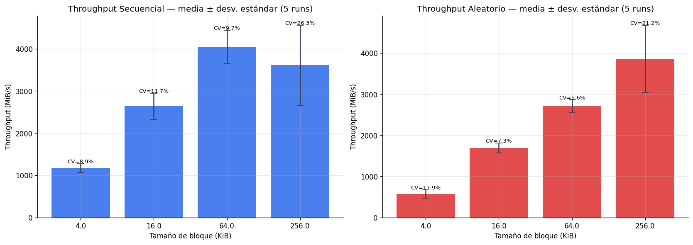
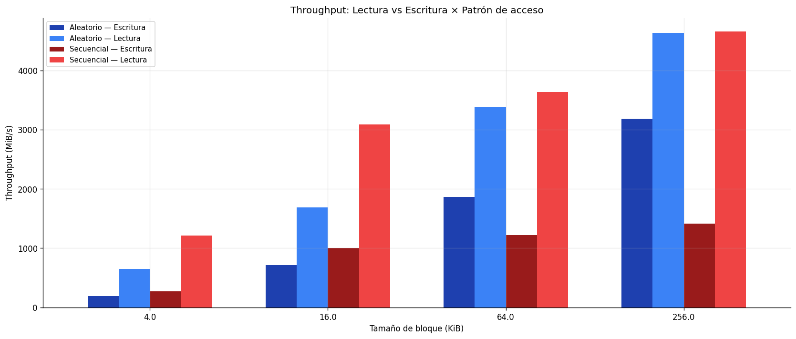
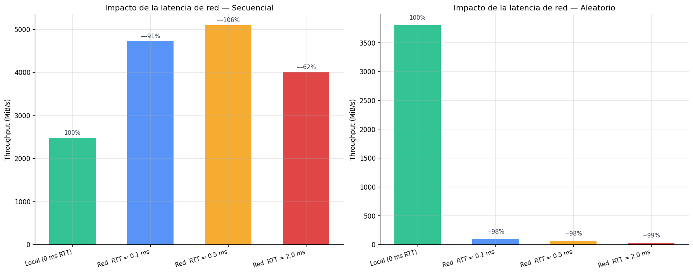
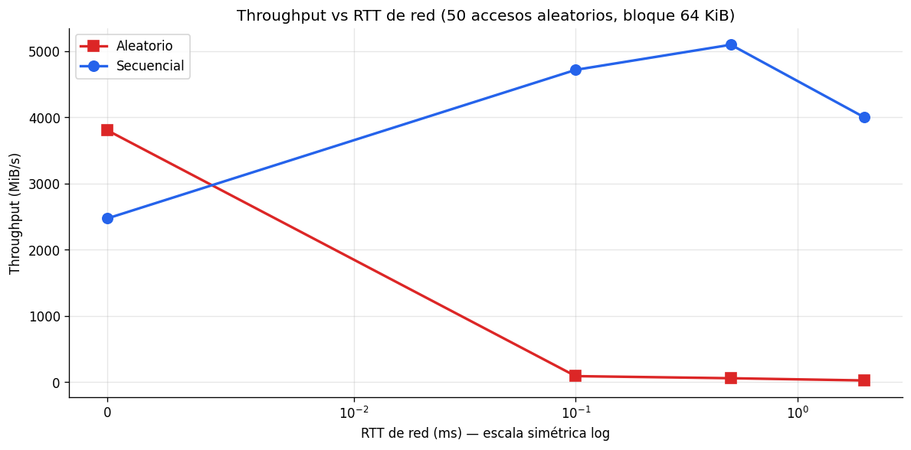
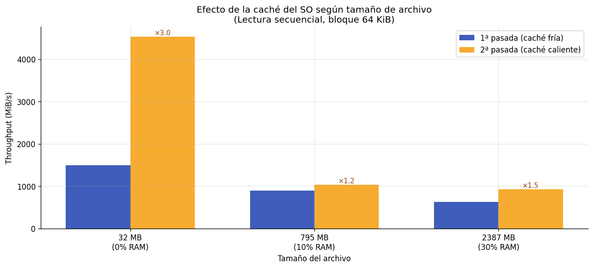
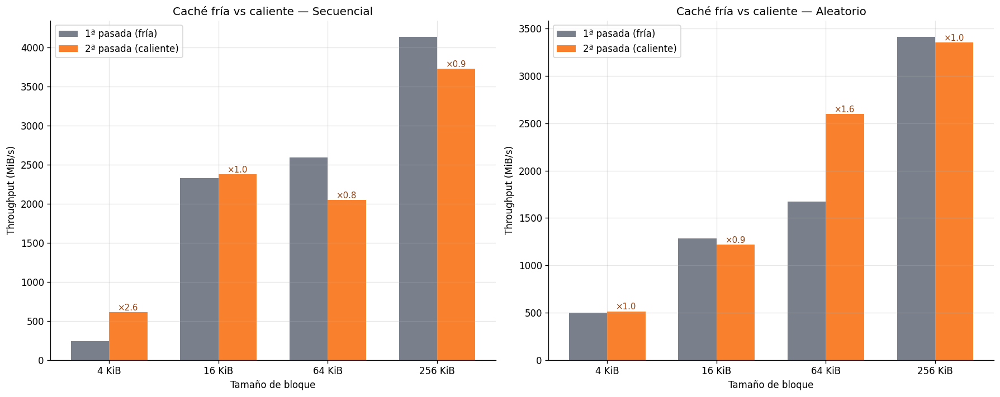
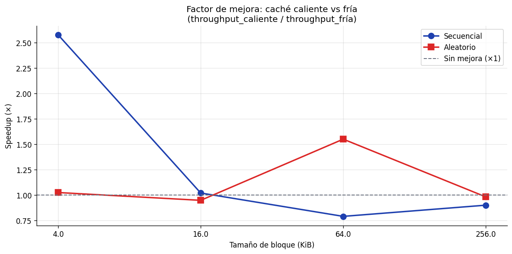

# lab3-IO_performance-CarolinaGomez

## Caracterización del Equipo

| Parámetro | Valor de Referencia |
| --- | --- |
| Sistema Operativo | Windows 11 25H2 |
| CPU (Modelo) | 11th Gen Intel Core i5-1135G7 @2.40 GHz |
| Arquitectura | x64 |
| Núcleos y Procesadores Lógicos | 4 núcleos / 8 procesadores lógicos |
| Memoria RAM Total | 8 GB |
| Tipo de Disco | SSD NVMe WDC PC SN530 SDBPNPZ-256G-1006 |
| Carga de CPU en Reposo | ~ 2% |

## Análisis del Experimento

## 1. Comparación de Patrones
***Con base en sus mediciones, ¿cuántas veces más rápido fue el acceso secuencial respecto al aleatorio en su equipo? ¿Ese resultado era el esperado según la teoría?***

Con base en los resultados del experimento, el acceso secuencial fue más rápido que el aleatorio en todos los tamaños de bloque evaluados, aunque la magnitud de esa ventaja varió bastante. Por ejemplo, con bloques de 4 KiB el acceso secuencial fue 3.79 veces más rápido que el aleatorio (978.10 MiB/s vs 258.01 MiB/s); sin embargo, a medida que aumentó el tamaño del bloque, esa ventaja fue reduciéndose progresivamente: ×1.40 en 16 KiB (2441.56 MiB/s vs 1743.53 MiB/s), ×1.36 en 64 KiB (3343.78 MiB/s vs 2461.11 MiB/s), hasta llegar a prácticamente ×1.01 en 256 KiB (3392.84 MiB/s vs 3351.96 MiB/s), donde ambos patrones alcanzaron casi el mismo throughput y, por ende, su diferencia es prácticamente despreciable.

Este resultado coincide con lo esperado por la teoría, ya que el modelo predice que en acceso aleatorio, con bloques pequeños, el término $AccessLatency \times M$ domina el tiempo total, pues cada uno de los 4000 posicionamientos paga un costo fijo trayendo muy pocos datos útiles. A medida que aumenta el tamaño del bloque, se traen más datos útiles por acceso y con ello se amortiza la latencia y se aumenta el rendimiento, tal como se muestra en la gráfica.

Ahora, en el acceso secuencial, el modelo también predijo correctamente que a partir de cierto tamaño del bloque el throughput converge y deja de mejorar a pesar de aumentar el tamaño del bloque, pues con $M \approx 1$ el costo de posicionamiento ya es mínimo desde el inicio y la latencia pasa a ser resultado únicamente del throuhgput físico del equipo.

## 2. Efecto del tamaño de bloque
***¿Qué ocurrió con el throughput del acceso aleatorio a medida que aumentó el tamaño de bloque? ¿Por qué cree que sucede eso?***

En ambos accesos el throughput creció. En el acceso secuencial obtuvo apenas una mejora de 3.47 veces (978.10 MiB/s con bloques de 4 KiB vs 3392.84 MiB/s con bloques de 256 KiB), mientras que en el acceso aleatorio creció muy significativamente, pues pasó de 258.01 MiB/s con bloques de 4 KiB hasta 3351.96 MiB/s con bloques de 256 KiB, una mejora de más de 13 veces sin necesidad de cambiar los componentes físicos de mi pc ni el número de accesos que teníamos por defecto.

La razón es que, como sabemos, el costo de $AccessLatency$ es fijo por acceso, independientemente de cuántos datos se lean en ese acceso. Cuando se tienen bloques pequeños, en el acceso aleatorio el costo de $AccessLatency$ domina, lo que deriva en una disminución del throughput, pero, al aumentar el tamaño del bloque y traer más datos por acceso, ese costo de $AccessLatency$ se amortigua y esto hace que se comience a maximizar el throughput.

## 3. Teoría vs Práctica 
***Identifique un caso en sus resultados donde la medición empírica se alejó del modelo teórico. ¿A qué factor atribuye esa diferencia?***

En general, la medición empírica en los dos tipos de acceso y en casi todos los tamaños de bloque medidos es subestimada por el modelo teórico, excepto en el acceso aleatorio y el tamaño de bloque de 16 KiB, donde es sobreestimada por el modelo teórico.

Ahora, analizando un caso en concreto, en el modelo secuencial el caso donde la medición empírica se alejó más del modelo teórico fue con bloques de 4 KiB, donde el modelo predijo un tiempo de 0.0500 s mientras que el empírico tardó 0.2617 s, mostrando una diferencia de 5.23 veces. Esto ocurre porque el modelo asume que el equipo opera a su throughput máximo de 5 GB/s desde que llega el primer dato y de forma sostenida, sin contemplar la sobrecarga de cada llamada al sistema operativo cuando se hacen todas las llamadas casi al mismo tiempo.

En el acceso aleatorio se puede destacar un caso bastante interesante. Con bloques de 16 KiB el tiempo empírico (0.0358 s) fue menor que el teórico (0.0522 s), con un factor de ×0.69. Este fue el único caso en todo el análisis donde el modelo teórico sobreestimó el modelo empírico, lo cual es una posible señal de que ese bloque no fue medido desde el disco como tal, sino que fue medido desde la RAM, y por lo tanto, derivó en una reducción del tiempo real que no estaba en sintonía con los resultados esperados.

## 4. Tipo de Disco 
***Compare sus resultados con los valores de referencia de la tabla de la guía. ¿Su equipo se comportó como un HDD, un SSD SATA o un SSD NVMe?***

| Tecnología | Latencia Promedio | Throughput Típico | IOPS Típico (4 KB aleatorio) | Escala de Tiempo |
| --- | --- | --- | --- | --- |
| **HDD** | 10 ms | 100 - 150 MB/s | 75 – 300 | Milisegundos |
| **SSD (SATA)** | 100 µs | 500 - 550 MB/s | 50,000 – 100,000 | Microsegundos |
| **SSD NVMe** | 10 - 20 µs | 2 - 7 GB/s | 500,000 – 1,000,000+ | Microsegundos |

Comparando los resultados obtenidos con la tabla de referencia, mi equipo se comportó como un SSD NVMe, teniendo como evidencia el throughput secuencial máximo alcanzado, que fue de 3392.84 MiB/s (~3.3 GB/s) con bloques de 256 KiB. Si comparamos detenidamente ese throughput máximo con los valores que están en la tabla, podemos ver que está completamente fuera del rango de un HDD (100 - 150 MB/s) y de un SSD SATA (500 - 550 MB/s), pero se ubica dentro del rango de un SSD NVMe (2 - 7 GB/s).

## 5. Aplicación Práctica 
***Imagine que debe almacenar una tabla de estudiantes con 1 millón de registros. Con base en lo que midió, ¿preferiría leerla toda de forma secuencial o acceder a registros individuales de forma aleatoria? ¿Por qué?***

Con base en los resultados obtenidos, sería más fácil leer la tabla de forma secuencial, ya que este tipo de acceso permite leer los datos de manera continua realizando un solo acceso al disco y con ello reduciendo significativamente el impacto de la latencia. En este caso no usaría el acceso aleatorio ya que éste implica muchos accesos dispersos, lo que aumenta el tiempo total; pero consideraría usarlo en situaciones donde solo necesite acceder a un número muy pequeño de registros porque finalmente leer toda la tabla de forma secuencial para encontrarlos sería muy ineficiente.

En general, para trabajar con la tabla (la cual tiene un gran volumen de datos) usaría el acceso secuencial, pero si necesito hacer una consulta muy puntual, usaría el acceso aleatorio.

## Conclusión

La información en disco no se accede byte por byte, sino por bloques completos y la forma en que esos bloques están distribuidos determinan la eficiencia del sistema. Cuando los datos son contiguos, el disco solo necesita posicionarse una única vez ($M \approx 1$) y leer todo en orden, mientras que cuando están dispersos, cada bloque exige un posicionamiento independiente. Esto explica por qué el patrón de acceso sigue importando incluso en un SSD: con bloques de 4 KiB el acceso secuencial fue ×3.79 veces más eficiente que el aleatorio (978.10 MiB/s vs 258.01 MiB/s). Esa brecha se cerró progresivamente al aumentar el tamaño del bloque, hasta desaparecer en 256 KiB (speedup de ×1.01), porque bloques más grandes amortizan el costo fijo de posicionamiento entre más datos útiles tengan. El modelo teórico capturó bien la tendecia general, pero sobreestimó el rendimiento real (predijo tiempos menores a los medidos) especialmente en el acceso secuencial con bloques pequeños, donde el empírico fue aproximadamente 5 veces mayor que el teórico. Con base en estos resultados, en un sistema real priorizaría almacenar juntos los datos que se consultan juntos, para garantizar $M \approx 1$, y, cuando el acceso aleatorio sea inevitable, trabajar con bloques más grandes que amorticen el costo de cada posicionamiento.

## Extensión del Experimento
Con el objetivo de ampliar el experimento, se realizó un código con ayuda de Claude.ai para abordar las extensiones sugeridas:

- Repetir el experimento varias veces y promediar los resultados.
- Comparar lectura y escritura.
- Medir sobre SSD local vs disco de red.
- Cambiar el tamaño del archivo y observar el efecto en la caché.
- Comparar caché caliente vs caché fría ejecutando el benchmark dos veces seguidas.

## Repetición del Experimento y Promedio de Resultados

Para esta primera parte se repitió la ejecución del código 5 veces y se promediaron los resultados obtenidos:

| Patrón | Tamaño Bloque | Throughput Mín. | Throughput Máx. | Media | Coef. Variación |
| --- | --- | --- | --- | --- | --- |
| Aleatorio | 4 KB | 398.9 | 655.7 | 573.5 | 17.9% |
| Secuencial | 4 KB | 1001.5 | 1286.4 | 1173.4 | 9.0% |
| Aleatorio | 16 KB | 1560.7 | 1817.5 | 1691.5 | 7.3% |
| Secuencial | 16 KB | 2281.1 | 2929.5 | 2638.6 | 11.7% |
| Aleatorio | 64 KB | 2527.4 | 2923.0 | 2714.1 | 5.6% |
| Secuencial | 64 KB | 3731.2 | 4658.6 | 4047.9 | 9.7% |
| Aleatorio | 256 KB | 2608.4 | 4696.0 | 3860.2 | 21.2% |
| Secuencial | 256 KB | 2224.4 | 4535.1 | 3610.5 | 26.3% |

Los resultados muestran una relación directa entre el tamaño del bloque y el throughput en ambos patrones de acceso: a medida que el tamaño del bloque aumenta, el rendimiento mejora significativamente. Esto se debe a que con bloques más grandes se necesitan menos operaciones I/O para transferir la misma cantidad de datos, reduciendo la sobrecarga acumulada de llamadas consecutivas al sistema operativo.

En cuanto a la comparación entre acceso secuencial y aleatorio, se observa que para los tamaños de bloques de 4 KB, 16 KB y 64 KB el acceso secuencial presenta un mayor throughput, lo cual es consistente con el comportamiento esperado. Sin embargo, para bloques de 256 KB el acceso aleatorio (3860.2 MiB/s) supera al secuencial (3610.5 MiB/s). Esto se explica principalmente por el volumen de datos transferidos: con 2000 accesos de 256 KB el aleatorio lee en total $2000 \times 256 = 512000 KB = 500 MB$, casi cuatro veces más que los 128 MB del archivo secuencial, lo que infla su throughput absoluto.

Por otro lado, el coeficiente de variación indica que las mediciones son más estables con bloques más pequeños (rango de 5.6% a 17.9%) y presentan mayor variabilidad con bloques de 256 KB, donde el CV supera el 20% en ambos patrones. Esta inestabilidad refleja la influencia de factores externos como el estado de la caché, procesos corriendo en segundo plano y la variabilidad interna del SSD, y confirma que una sola medición no es suficiente para caracterizar el rendimiento del sistema de forma confiable.

## Comparación de Lectura vs Escritura

| Tamaño del Bloque | Escritura - Aleatorio | Lectura - Aleatorio | Escritura - Secuencial | Lectura - Secuencial |
| --- | --- | --- | --- | --- |
| 4 KB | 189.2 | 649.6 | 273.5 | 1213.0 |
| 16 KB	| 711.4	| 1690.3 | 1000.7 | 3086.2 |
| 64 KB	| 1865.0 | 3389.7 | 1224.0 | 3635.6 |
| 256 KB | 3187.2 |	4634.9 | 1414.9	| 4654.4 |

En todos los casos el throughput de lectura supera al de escritura, tanto en acceso secuencial como aleatorio. Este comportamiento se debe a que las operaciones de escritura implican un mayor overhead, incluyendo el uso de buffers y costos que la lectura no tiene, lo que termina reduciendo el throughput efectivo de escritura.

La lectura secuencial alcanza los valores más altos en todos los tamaños de bloque, llegando a 4654.4 MiB/s con bloques de 256 KB. Esto se debe a que con $M \approx 1$ el costo de posicionamiento se paga una sola vez y luego se leen los datos de forma continua, lo que hace que se reduzca la latencia percibida de cada operación.

Un resultado llamativo es la convergencia entre lectura y escritura al aumentar el tamaño del bloque. Con 4 KB la lectura aleatoria (649.6 MiB/s) triplicó a la escritura aleatoria (189.2 MiB/s), pero con 256 KB esa brecha se redujo a apenas ×1.45 (4634.9 vs 3187.2 MiB/s). Esto indica que el mismo mecanismo de amortización del costo de posicionamiento que se observó durante la ejecución del laboratorio sin extensión, opera aquí.

Por otro lado, se observa que la escritura secuencial, aunque mejora con el tamaño del bloque, presenta una desaceleración entre 64 KB y 256 KB, donde el throughput apenas sube de 1224 a 1414.9 MiB/s (×1.15), muy por debajo del crecimiento observado en tramos anteriores. Esto sugiere que el buffer de escritura interno del SSD se saturó en algún punto, obligando a mi equipo a escribir directamente en la memoria con su penalización completa y limitando el throughput.

## SSD Local vs Disco de Red

| Escenario | Throughput Aleatorio | Throughput Secuencial |
| --- | --- | --- |
| Local (0 ms RTT) | 3804.5 | 2471.5 |
| Red  RTT = 0.1 ms | 90.6 | 4716.4 |
| Red  RTT = 0.5 ms | 58.9 | 5095.5 |
| Red  RTT = 2.0 ms | 25.2 | 3998.4 |

Los resultados muestran que el acceso aleatorio colapsa drásticamente ante cualquier latencia de red, pues pasa de 3804.5 MiB/s en local a apenas 25.2 MiB/s con RTT = 2ms, teniendo una degradación de ×151. La razón se desprende directamente del modelo teórico en acceso aleatorio, ya que cada posicionamiento paga un RTT independiente, lo que aumenta la latencia total y reduce directamente el rendimiento.

El acceso secuencial, en cambio, no se degrada con el RTT sino que muestra valores similares o incluso superiores al caso local. Esto se explica porque en acceso secuencial $M \approx 1$, lo que indica que el RTT se paga una única vez al inicio para localizar el archivo y, a partir de ahí, se realiza la transferencia sin interrupciones.

La implicación es directa, pues se evidencia que en sistemas que acceden a archivos remotos, el patrón de acceso importa más que la velocidad del disco local. Un acceso aleatorio sobre un disco de red puede ser demasiado lento en comparación al mismo acceso sobre un disco local, mientras que un acceso secuencial es prácticamente indiferente al RTT. Por eso en muchos sistemas distribuidos se organizan los datos para favorecer lecturas secuenciales y minimizar los costos de búsqueda en los discos de red.

## Efecto del Tamaño del Archivo en la Caché

Todas las mediciones se realizaron con bloques fijos de 64 KiB y acceso secuencial, dando como resultado:

| Tamaño del Archivo | Caché Fría (MiB/s) | Caché Caliente (MiB/s) | Factor |
| --- | --- | --- | --- |
| 32 MB | 1492.5 | 4537.0 | ×3.04 |
| 795 MB | 898.3 | 1041.0 | ×1.16 |
| 2387 MB |	634.7 |	932.9 | ×1.47 |

Los resultados muestran que el efecto de la caché del sistema operativo depende directamente de qué proporción del archivo cabe en la caché entre la primera y la segunda lectura. Con el archivo de 32 MB, que representa menos del 1% de los 7.8 GB de RAM disponibles, la segunda lectura fue ×3 más rápida que la primera (4537 vs 1493 MiB/s), lo que indica que el archivo quedó completamente en caché y la segunda lectura fue atendida casi en su totalidad desde memoria.

A medida que el tamaño del archivo crece, el factor de mejora se reduce. Con 795 MB (~10% de la RAM) el factor cae a ×1.2 y con 2387 MB (~30% de la RAM) sube levemente a ×1.5. La razón de este comportamiento es que con archivos grandes, el sistema operativo debe comenzar a desalojar páginas de la caché para poder atender otras demandas de memoria mientras se realiza la segunda lectura, de modo que parte de los bloques deben leerse nuevamente desde el disco.

Este resultado valida la conclusión a la que llegamos en la primera parte del laboratorio, donde, con un archivo de 256 MB en un equipo con 7.8 GB de RAM disponible, varias de las mediciones originales probablemente fueron atendidas desde la caché en lugar del disco físico, haciendo que los tiempo registrados fueran más optimistas que los que se obtendrían con el disco como tal.

## Caché Caliente vs Caché Fría

| Patrón | Tamaño del Bloque | Throughput Fría | Throughput Caliente | Speedup |
| --- | --- | --- | --- | --- |
| Secuencial | 4 KB | 237.87 | 613.10 | ×2.58 |
| Aleatorio	| 4 KB | 500.63 | 513.40 | ×1.03 |
| Secuencial | 16 KB | 2326.99 | 2375.70 | ×1.02 |
| Aleatorio	| 16 KB | 1285.87 | 1219.88 | ×0.95 |
| Secuencial | 64 KB | 2591.30 | 2049.21 | ×0.79 |
| Aleatorio | 64 KB | 1675.05 | 2597.67 | ×1.55 |
| Secuencial | 256 KB |	4134.89 | 3725.26 | ×0.90 |
| Aleatorio | 256.0	| 3414.53 | 3354.90 | ×0.98 |

Los resultados muestran que el impacto de la caché no es uniforme y depende tanto del patrón de acceso como del tamaño del bloque. El caso más claro es el acceso secuencial con bloques de 4 KB, donde el speedup alcanzó ×2.58, indicando que con bloques muy pequeños la primera ejecución acumula una sobrecarga enorme de llamadas al sistema y la segunda se beneficia de que los datos ya están en la caché, reduciendo esa penalización.

Un resultado llamativo es que el acceso aleatorio con bloques de 4 KB apenas mejoró (×1.03), cuando intuitivamente debería ser donde más ayuda la caché. La explicación sería que con 128 MB de archivo y 2000 accesos aleatorios, los bloques visitados en la primera ejecución se distribuyen por todo el archivo y es poco probable que los mismos bloques sean solicitados en el mismo orden en la segunda ejecución, lo que limita el aprovechamiento de la caché.

Ahora, el resultado más díficil de implementar son los speedups menores a 1 (×0.95, ×0.79, ×0.90 y ×0.98), donde la caché caliente fue más lenta que la fría. Esto no contradice la teoría, sino que indica una limitación en el entorno de medición: sin control sobre variables externas como procesos corriendo en segundo plano o la cola interna del SSD, la variabilidad natural entre ejecuciones puede superar fácilmente la ganancia de la caché, produciendo resultados donde la segunda ejecución resulta más lenta por factores ajenos al experimento.

## Conclusión
Los experimentos realizados permiten evidenciar de manera integral cómo distintos factores afectan el rendimiento de operaciones I/O en sistemas de almacenamiento.

En primer lugar, se observó que el tamaño del bloque tiene un impacto significativo en el throughput, el cual aumenta a medida que el tamaño crece debido a la reducción de la sobrecarga producida por operación. Asimismo, se confirmó que las operaciones de lectura presentan un mayor rendimiento que las de escritura, lo cual se podría explicar por el menor costo operativo asociado a la lectura frente a los mecanismos adicionales involucrados en la escritura.

En cuanto al patrón de acceso, el acceso secuencial mostró consistentemente un mejor desempeño que el acceso aleatorio, especialmente en tamaños de bloque pequeño.

Por otro lado, el análisis del impacto de la caché demostró que su efectividad depende fuertemente del tamaño del archivo y su patrón de acceso. En archivos pequeños, la caché permite mejoras significativas en el rendimiento, mientras que en archivos grandes su impacto es limitado debido a restricciones de memoria. Además, se evidenció que la caché no siempre garantiza mejoras, ya que en ciertos escenarios puede no tener efecto o incluso puede introducir una sobrecarga adicional.

Finalmente, el experimento con latencia de red (RTT) mostró que el acceso aleatorio es altamente sensible a la latencia, presentando una degradación drástica en el throughput a medida que aumenta el RTT.

En conjunto, estos resultados evidencian que el rendimiento de I/O no depende de un único factor, sino de la interacción entre el tamaño del bloque, el patrón de acceso, el uso de caché y las condiciones del sistema. Por ello, es necesario diseñar sistemas y aplicaciones considerando estos elementos para poder optimizar el desempeño.